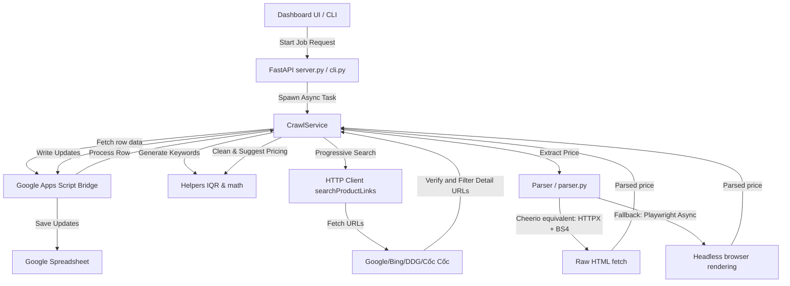

# Target Python Architecture - CrawlData

This document details the software design, folder organization, data schema, flowcharts, and libraries for the rewritten Python version of CrawlData.

---

## 1. Tech Stack Decisions

We choose the following libraries for the Python 3.12+ project:

1. **Backend Framework**: **FastAPI** + **Uvicorn**
   - High performance, native support for async/await, and automatic openAPI docs.
2. **HTTP Request Client**: **HTTPX** (Asynchronous)
   - Supports HTTP/2, async connections, connection pooling, and matches standard Python request paradigms.
3. **HTML Parsing Engine**: **BeautifulSoup4** (with `lxml` parser)
   - Standard, highly reliable library for extracting elements from raw HTML.
4. **Browser Automation**: **Playwright (Python Async)**
   - Faster, more stable, and easier to install than Pyppeteer. Supports async request interception to block images/stylesheets/trackers.
5. **Config & Schema Validation**: **Pydantic v2** & **Pydantic-Settings**
   - Strictly validates configuration schemas, environment files, request payloads, and background job records.
6. **Command Line Interface**: **Typer**
   - Build CLI tools matching the syntax of the application.
7. **Test Framework**: **pytest** & **pytest-asyncio**
   - Rich testing tools, fixture definitions, and native support for async unit testing.
8. **Code Quality**: **Ruff**
   - Extremely fast linter and formatter replacing flake8, black, isort, and bandit.

---

## 2. Directory Layout

The rewrite follows the proposed layout:

```text
crawldata/
├── src/
│   └── crawldata/
│       ├── __init__.py
│       ├── main.py                # FastAPI HTTP entrypoint
│       ├── cli.py                 # Typer CLI entrypoint
│       ├── config.py              # Environment configuration loader
│       ├── logger.py              # Logging setup
│       ├── crawler/
│       │   ├── __init__.py
│       │   ├── base.py            # Base classes & types
│       │   ├── http_client.py     # httpx client routines
│       │   ├── parser.py          # BS4 and Playwright parser heuristics
│       │   └── pipelines.py       # Cleaning operations
│       ├── services/
│       │   ├── __init__.py
│       │   └── crawl_service.py   # Job controller, Google Apps Script connector
│       ├── storage/
│       │   ├── __init__.py
│       │   └── database.py        # In-memory pricing job state and CacheStore
│       ├── schemas/
│       │   ├── __init__.py
│       │   └── data.py            # Pydantic schemas (Job status, updates)
│       └── utils/
│           ├── __init__.py
│           └── helpers.py         # Text Normalization, Outliers detection, Math utilities
├── tests/
│   ├── test_parser.py
│   ├── test_crawler.py
│   ├── test_storage.py
│   ├── test_cli.py
│   └── test_utils.py
├── docs/
│   ├── current-behavior.md
│   └── architecture.md
├── .env.example
├── .gitignore
├── README.md
├── pyproject.toml
└── Dockerfile
```

---

## 3. Data Flow



---

## 4. How to Extend

### Adding a New Search Engine
1. Open [src/crawldata/crawler/http_client.py](file:///c:/Users/ACER/cong-cu-cao-web/src/crawldata/crawler/http_client.py).
2. Register the search method under `search_product_links`.
3. Extract URL elements from the response markup using BeautifulSoup.
4. Normalize links using `normalize_search_href`.

### Adding a Custom Layout Price Parser
1. Open [src/crawldata/crawler/parser.py](file:///c:/Users/ACER/cong-cu-cao-web/src/crawldata/crawler/parser.py).
2. Inside `extract_price_text`, register specific checks or selectors for target domains.
3. If JS rendering is needed, include custom logic inside the Playwright execution evaluate block.
